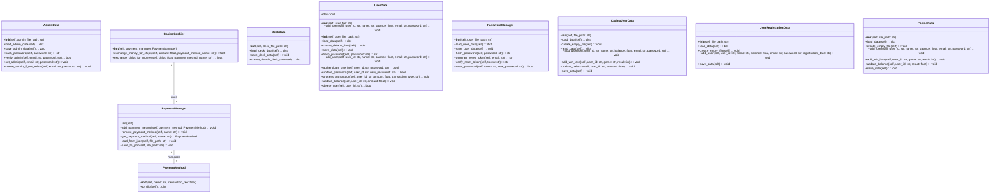

```mermaid

classDiagram
    %% admin_data.py
    class AdminData {
        +__init__(self, admin_file_path: str)
        +load_admin_data(self): dict
        +save_admin_data(self): void
        +hash_password(self, password: str): str
        +verify_admin(self, email: str, password: str): bool
        +set_admin(self, email: str, password: str): void
        +create_admin_if_not_exists(self, email: str, password: str): void
    }
    
    %% cashier.py
    class PaymentMethod {
        +__init__(self, name: str, transaction_fee: float)
        +to_dict(self): dict
    }

    class PaymentManager {
        +__init__(self)
        +add_payment_method(self, payment_method: PaymentMethod): void
        +remove_payment_method(self, name: str): void
        +get_payment_method(self, name: str): PaymentMethod
        +load_from_json(self, file_path: str): void
        +save_to_json(self, file_path: str): void
    }

    class CasinoCashier {
        +__init__(self, payment_manager: PaymentManager)
        +exchange_money_for_chips(self, amount: float, payment_method_name: str): float
        +exchange_chips_for_money(self, chips: float, payment_method_name: str): float
    }

    %% deck_data.py
    class DeckData {
        +__init__(self, deck_file_path: str)
        +load_deck_data(self): dict
        +save_deck_data(self): void
        +create_default_deck_data(self): dict
    }

    %% get_data_from_JSON.py
    class UserData {
        +__init__(self, user_file: str)
        +add_user(self, user_id: str, name: str, balance: float, email: str, password: str): void
        +data: dict
    }

    %% password_manager.py
    class PasswordManager {
        +__init__(self, user_file_path: str)
        +load_user_data(self): dict
        +save_user_data(self): void
        +hash_password(self, password: str): str
        +generate_reset_token(self, email: str): str
        +verify_reset_token(self, token: str): str
        +reset_password(self, token: str, new_password: str): bool
    }

    %% plot_casino_revenue.py
    class CasinoUserData {
        +__init__(self, file_path: str)
        +load_data(self): dict
        +create_empty_file(self): void
        +read_data(self): dict
        +add_user(self, user_id: str, name: str, balance: float, email: str, password: str): void
        +add_win_loss(self, user_id: str, game: str, result: int): void
        +update_balance(self, user_id: str, amount: float): void
        +save_data(self): void
    }

    %% plot_user_growth.py
    class UserRegistrationData {
        +__init__(self, file_path: str)
        +load_data(self): dict
        +create_empty_file(self): void
        +add_user(self, user_id: str, name: str, balance: float, email: str, password: str, registration_date: str): void
        +save_data(self): void
    }

    %% plot_user_wins_losses.py
    class CasinoData {
        +__init__(self, file_path: str)
        +load_data(self): dict
        +create_empty_file(self): void
        +add_user(self, user_id: str, name: str, balance: float, email: str, password: str): void
        +add_win_loss(self, user_id: str, game: str, result: int): void
        +update_balance(self, user_id: str, result: float): void
        +save_data(self): void
    }

    %% user_data.py
    class UserData {
        +__init__(self, user_file_path: str)
        +load_data(self): dict
        +create_default_data(self): void
        +save_data(self): void
        +hash_password(self, password: str): str
        +add_user(self, user_id: str, name: str, balance: float, email: str, password: str): void
        +authenticate_user(self, user_id: str, password: str): bool
        +update_password(self, user_id: str, new_password: str): bool
        +process_transaction(self, user_id: str, amount: float, transaction_type: str): void
        +update_balance(self, user_id: str, amount: float): void
        +delete_user(self, user_id: str): bool
    }

    PaymentManager "1" -- "n" PaymentMethod : manages
    CasinoCashier "1" -- "1" PaymentManager : uses
```

Il file casino.py utilizza tutte queste classi:
- AdminData
- PaymentManager
- CasinoCashier
- DeckData
- UserData
- PasswordManager
- CasinoUserData
- UserRegistrationData
- CasinoData